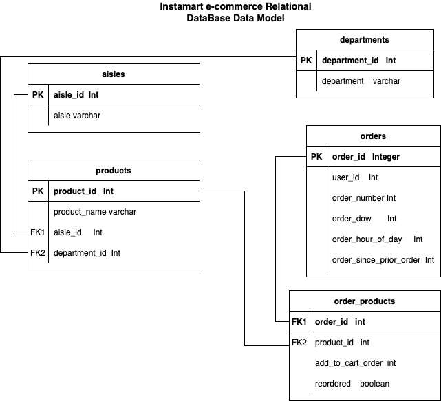

# SQL for Data Engineering using PostgreSQL

This project focuses on creating databases and tables, establishing relational connections, and finally importing large e-commerce datasets into these database tables. All these tasks were accomplished using Python.

## Data Model

Before building the databases, a **Data Model** was created to provide a clear picture of the overall data structure, facilitating the database design process.



## Libraries Used

The following libraries were utilized in this project:

```python
import pandas as pd
import psycopg2 as psy
from sqlalchemy import create_engine
```

- **PostgreSQL** - Chosen as the Relational Database Management System due to its open-source nature and high demand across various use cases.
- **psycopg2** - A widely-used PostgreSQL adapter for Python, enabling efficient communication between Python applications and PostgreSQL databases.
- **SQLAlchemy** - Employed for efficiently dumping or inserting data into the database tables. Manual insertion through loops is time-consuming and computationally expensive, especially when dealing with large datasets. SQLAlchemy offers a high-level Object-Relational Mapping (ORM) system and a flexible SQL Expression Language for executing raw SQL queries.
 **Bulk Insertion**: SQLAlchemy allows for bulk data insertion into database tables, improving performance and efficiency.

- Refer to the Jupyter Notebook `instamart_postgresql@jupy.ipynb` for detailed code implementations.

- The dataset used for this project is sourced from Kaggle. You can download it from the following link: [DataSet Link](https://drive.google.com/drive/folders/1pjmEQOxse7Q3kldm7YPBUANS4Nlo7rCc?usp=drive_link)

  ### Once the data loads, Start Analysing...
